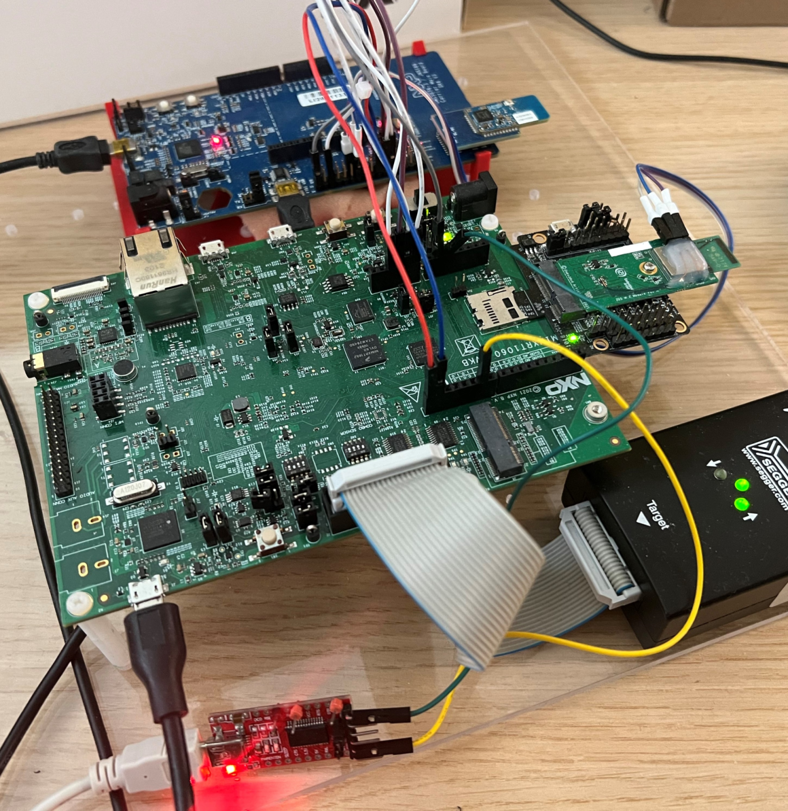
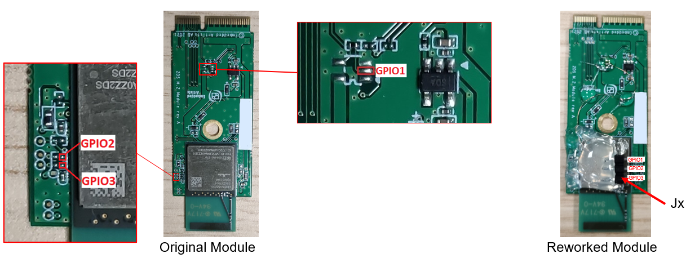

# NXP Application Code Hub
[](https://www.nxp.com)

## Basic Matter Ready Connected HMI Application
### Cost-optimized MCU (FreeRTOS) platform with Wi-Fi 4, Thread, BLE 5
NXP's cost-optimized MCU (FreeRTOS)
  platform enables Matter-ready edge node development with Wi-Fi 4, Thread, and BLE 5 wireless connectivity protocols using i.MX RT1060 MCU, K32W0x MCU, and 88W8801 Wi-Fi SoC.

#### Boards: EVK-MIMXRT1060
#### Categories: Wireless Connectivity, HMI, Cloud connected devices, RTOS
#### Peripherals: DISPLAY, DMA, FLASH, GPIO, I2C, SPI, UART, USB
#### Toolchains: GCC

## Table of Contents
1. [Software](#step1)
2. [Hardware](#step2)
3. [Setup](#step3)
4. [Building](#step4)
5. [Building the ot-rcp binary](#step5)
6. [Running the IHD example](#step6)
7. [Using the OTA Provider feature](#step7)
8. [Connecting to a WiFi network using the Matter CLI](#step8)
9. [Changing the WiFi network](#step9)
10. [FAQs](#step10) 
11. [Support](#step11)
12. [Release Notes](#step12)
13. [Known Issues](#step13)

## 1. Software<a name="step1"></a>
### Repository structure

This repository contains several folders related to the project:

- **basic_connected_hmi_app** folder, which contains the necessary project build, source and include files for the Basic Connected HMI Application, together with patches necessary to be applied to the Matter repository.
- **binaries** folder, which contains precompiled binaries for the Basic Connected HMI application in Thread only, Wi-Fi only without precompiled credentials and Thread+Wi-Fi without precompiled credentials. For further information, please see binaries_readme.md in the binaries folder.
- **build** folder, which contains required symlinks to the Matter repository to successfuly build application on top of Matter repository.
- **matter** folder, which holds the Matter SDK and is pointed as a submodule to the repository.

## 2. Hardware<a name="step2"></a>

The application requires the following hardware setup:
- [RT1060 EVKB](https://www.nxp.com/search?keyword=mimxrt1060-evkb) (Or EVKA) development board with [RK043FN02H-CT](https://www.nxp.com/part/RK043FN02H-CT#/) 4.3-inch TFT 480*272 LCD
- K32W0x1 mezzanine module (for Thread connection)
- [IOTZTB-DK006](https://www.nxp.com/part/IOTZTB-DK006#/) carrier board for the K32W0x1 module (referenced as DK6 carrier board)
- 2.54 mm jumper cables
- 88W8801 module (for WiFi connection), for example 88W8801 2DS M.2 Module (rev A) and Murata uSD-M.2 Adapter (rev B1)

> **_Note:_** as the 88W8801 module supports only the 2.4 GHz Wi-Fi band, it is mandatory to connect it to a WiFi access point on the 2.4 GHz band.

### Hardware connections

Using the K32W0x1 module connected to IOTZTB-DK006 carrier board, the following connections need to be made between the boards using jumper wires:

|    PIN NAME    |  DK6 (K32W061)    | I.MXRT1060-EVKB | I.MXRT1060-EVK | PIN NAME OF RT1060 | GPIO NAME OF RT1060 | 88W8801 pin |
|----------------|-------------------|-----------------|----------------|--------------------|---------------------|-------------|
| UART0_TXD      | PIO(J3), pin 8    |    J16, pin 1   |   J22, pin 1   |    LPUART3_RXD     |    GPIO_AD_B1_07    |    --       |
| UART0_RXD      | PIO(J3), pin 9    |    J16, pin 2   |   J22, pin 2   |    LPUART3_TXD     |    GPIO_AD_B1_06    |    --       |
| UART0_RTS      | PIO(J3), pin 6    |    J33, pin 3   |   J23, pin 3   |    LPUART3_CTS     |    GPIO_AD_B1_04    |    --       |
| UART0_CTS      | PIO(J3), pin 7    |    J33, pin 4   |   J23, pin 4   |    LPUART3_RTS     |    GPIO_AD_B1_05    |    --       |
| UART1_TXD      | PIO(J3), *pin 10* |    J16, pin 8   |   J22, pin 8   |    LPUART2_RX      |    GPIO_AD_B1_03    |    --       |
| UART1_RXD      | PIO(J3), *pin 11* |    J16, pin 7   |   J22, pin 7   |    LPUART2_TX      |    GPIO_AD_B1_02    |    --       |
| GND            | J3, pin 1         |    J32, pin 7   |   J25, pin 7   |    XX              |    XX               |    --       |
| RESET          | J3, RSTN          |    J33, pin 2   |   J23, pin 2   |    GPIO_AD_B1_11   |    GPIO_AD_B1_11    |    --       |
| DIO5/ISP Entry | PIO(J3), pin 5    |    J33, pin 1   |   J23, pin 1   |    GPIO_AD_B1_10   |    GPIO_AD_B1_10    |    --       |
| K32W0_PRIO     | PIO(J3), pin 16   |    --           |   --           |    --              |    --               |    GPIO2    |
| K32W0_REQ      | PIO(J3), pin 15   |    --           |   --           |    --              |    --               |    GPIO3    |
| 8801_GRANT     | PIO(J3), pin 14   |    --           |   --           |    --              |    --               |    GPIO1    |

* Please check actual config for UART1 on K32W0x1 application as it depends whether USART1_FTDI is defined or not. If USART1_FTDI is defined, UART1_TXD is moved to pin 0 and UART1_RXD to pin 1 on the same J3 header. ot_rcp_ble_hci_bb app has USART1_FTDI defined by default.

* When using `chip_enable_matter_cli=true` and `chip_cli_logs_same_interface=false` in the RT build, the application prints the Matter logs using LPUART2_TX, on GPIO_AD_B1_02 pin. These can be verified using an FTDI to USB adapter. If `chip_cli_logs_same_interface` is set to true, then the logs are printed on the same interface as CLI. Entering the `matterlogs` command in CLI enables/disables the printing of the Matter logs.

Please see the image below as reference for hardware setup between the boards.



## 3. Setup<a name="step3"></a>

Use the following steps to get the environment set up. If you have trouble activating the Matter virtual environment, please check [here](https://github.com/project-chip/connectedhomeip/blob/master/docs/guides/BUILDING.md) for requirements related to the Matter repo.

This example assumes this repo is cloned to your home directory (~).

```
user@ubuntu: ~/connectivity_toolbox$ git submodule update --init --remote
user@ubuntu: ~/connectivity_toolbox$ cd matter
user@ubuntu: ~/connectivity_toolbox/matter$ source ./scripts/activate.sh
user@ubuntu: ~/connectivity_toolbox/matter$ git submodule update --init --recursive
user@ubuntu: ~/connectivity_toolbox/matter$ cd ..
user@ubuntu: ~/connectivity_toolbox$
```

### Setup RT1060 environment

In order to build the Connectivity Toolbox examples for RT1060, we recommend using a Linux distribution (the demo-application was compiled on Ubuntu 20.04).

Download NXP MCUXpresso SDK 2.13.0 and associated middleware from GitHub using the west tool.

```
user@ubuntu: ~/connectivity_toolbox$ cd matter/third_party/nxp/rt_sdk/repo
user@ubuntu: ~/connectivity_toolbox/matter/third_party/nxp/rt_sdk/repo$ west init -l manifest --mf west.yml
user@ubuntu: ~/connectivity_toolbox/matter/third_party/nxp/rt_sdk/repo$ west update
```

Apply the patches to the downloaded SDK.

```
user@ubuntu: ~/connectivity_toolbox/matter/third_party/nxp/rt_sdk/repo$ cd ../sdk_fixes
user@ubuntu: ~/connectivity_toolbox/matter/third_party/nxp/rt_sdk/sdk_fixes$ ./patch_rt_sdk.sh
user@ubuntu: ~/connectivity_toolbox/matter/third_party/nxp/rt_sdk/sdk_fixes$ cd ../../../../../basic_connected_hmi_app/
```

In case you want to update the already downloaded SDK and/or reapply the SDK patches (which should be done when the manifest/west.yml file or the patches have changed), use the west for all command instead of the west init to reset the west workspace before running the west update command and applying patches again.

```
user@ubuntu: ~/connectivity_toolbox/matter/third_party/nxp/rt_sdk/repo$ west forall -c "git reset --hard && git clean -xdf" -a
```

## 4. Building<a name="step4"></a>

### Command Line
To build the Basic Connected HMI application, follow these steps. This application is based on the RT1060 all cluster app Matter SDK example.

```
user@ubuntu: ~/connectivity_toolbox$ cd basic_connected_hmi_app
```
Apply the patches to the Matter and RT SDKs.

```
user@ubuntu: ~/connectivity_toolbox/basic_connected_hmi_app$ cd patch
user@ubuntu: ~/connectivity_toolbox/basic_connected_hmi_app/patch$ ./patch_rt_app.sh
user@ubuntu: ~/connectivity_toolbox/basic_connected_hmi_app$ cd ..
```

There are several configurations available at build time:
- RT1060 + K32W0 RCP (Thread only)
- RT1060 + 88W8801 (WiFi only)
- RT1060 + K32W0 RCP + 88W8801 (Thread+WiFi with/without PTA)

#### Thread only configuration
  
  The Thread application embeds the K32W0 RCP binary which will be programmed via OTW at boot time. In order to build the image and embed a specific RCP version, user needs to add to the build generator the following: `k32w0_transceiver_bin_path=\"/path/to/build_k32w061/ot_rcp_ble_hci_bb_single_uart_fc/bin/ot-rcp-ble-hci-bb-k32w061.elf.bin.h\"`. Otherwise, the build will use the default path, which is `matter/third_party/openthread/ot-nxp/ot_rcp_ble_hci_bb_single_uart_fc/bin/ot-rcp-ble-hci-bb-k32w061.elf.bin.h`. This means that the RCP binary needs to be recompiled before building the application, which is described in the [Building the ot-rcp binary chapter](#step5) below.
  
  For convenience, the precompiled binaries can be used in building the application by adding to the build generator `k32w0_transceiver_bin_path=\"/home/<user>/connectivity_toolbox/binaries/k32w0_rcp_app/<BOARD_FORMAT>/<ot_rcp_app>/bin/<ot_rcp_app>.elf.bin.h\"`, where <BOARD_FORMAT> can be dk6 and <ot_rcp_app> can be ot_rcp_ble_hci_bb_single_uart_fc, ot_rcp_ble_hci_bb_single_uart_fc_pta, rcp_only_uart_flow_control or rcp_only_uart_flow_control_pta.

For example:

```shell
user@ubuntu: ~/connectivity_toolbox/basic_connected_hmi_app$ k32w0_transceiver_bin_path=${PWD}/../binaries/k32w0_rcp_app/dk6/ot_rcp_ble_hci_bb_single_uart_fc/bin/ot-rcp-ble-hci-bb-k32w061.elf.bin.h
user@ubuntu: ~/connectivity_toolbox/basic_connected_hmi_app$ gn gen --args="chip_enable_openthread=true k32w0_transceiver=true k32w0_transceiver_bin_path=\"${k32w0_transceiver_bin_path}\" chip_inet_config_enable_ipv4=false chip_config_network_layer_ble=true hci_spinel_single_uart=true" out/debug
user@ubuntu: ~/connectivity_toolbox/basic_connected_hmi_app$ ninja -C out/debug
```

Build the application with display support and default path for ot-rcp binary.

```shell
user@ubuntu: ~/connectivity_toolbox/basic_connected_hmi_app$ gn gen --args="chip_enable_openthread=true k32w0_transceiver=true chip_inet_config_enable_ipv4=false chip_config_network_layer_ble=true hci_spinel_single_uart=true" out/debug
user@ubuntu: ~/connectivity_toolbox/basic_connected_hmi_app$ ninja -C out/debug
```

#### WiFi only configuration

Build the WiFi only application for EVKB-MIMXRT1060 board + 88W8801 with Matter-over-Wifi configuration and only onnetwork commissioning (without BLE, the WiFi network credentials are provided at build-time which will enable the device to join the Wi-Fi AP at startup). Replace wifi_ssid and wifi_password with your network's configuration. 

```shell
user@ubuntu: ~/connectivity_toolbox/basic_connected_hmi_app$ export nwk_name=<my_ssid>
user@ubuntu: ~/connectivity_toolbox/basic_connected_hmi_app$ export nwk_pass=<my_pass>
user@ubuntu: ~/connectivity_toolbox/basic_connected_hmi_app$ gn gen --args="chip_enable_wifi=true w8801_transceiver=true chip_config_network_layer_ble=false wifi_ssid=\"${nwk_name}\" wifi_password=\"${nwk_pass}\"" out/debug
user@ubuntu: ~/connectivity_toolbox/basic_connected_hmi_app$ ninja -C out/debug
```

#### Thread and WiFi configuration

The following build command are to be used in case of Thread and WiFi configuration. Note the ```wifi_enable_pta``` argument which needs to be used with hardware connections between 88W8801 and K32W0x1 IOTZTB-DK006 setup for PTA enablement.

```shell
user@ubuntu: ~/connectivity_toolbox/basic_connected_hmi_app$ export nwk_name=<my_ssid>
user@ubuntu: ~/connectivity_toolbox/basic_connected_hmi_app$ export nwk_pass=<my_pass>
user@ubuntu: ~/connectivity_toolbox/basic_connected_hmi_app$ k32w0_transceiver_bin_path=${PWD}/../binaries/k32w0_rcp_app/dk6/ot_rcp_ble_hci_bb_single_uart_fc_pta/bin/ot-rcp-ble-hci-bb-k32w061.elf.bin.h
user@ubuntu: ~/connectivity_toolbox/basic_connected_hmi_app$ gn gen --args="chip_enable_openthread=true k32w0_transceiver=true k32w0_transceiver_bin_path=\"${k32w0_transceiver_bin_path}\" chip_inet_config_enable_ipv4=false chip_config_network_layer_ble=true hci_spinel_single_uart=true chip_enable_wifi=true w8801_transceiver=true wifi_ssid=\"${nwk_name}\" wifi_password=\"${nwk_pass}\" wifi_enable_pta=true" out/debug
user@ubuntu: ~/connectivity_toolbox/basic_connected_hmi_app$ ninja -C out/debug
```

Please see the image below as reference for PTA hardware enablement.



> **_Note:_** In order to build and run on EVKA board, add `evkname=\"evkmimxrt1060\"` to the gn gen command.

## 5. Building the ot-rcp binary<a name="step5"></a>

The codebase for building the ot-rcp with or without BLE support can be found in matter/third_party/openthread/ot-nxp folder. Precompiled binaries are available in the binaries folder.
Prerequisites for signing the K32W061 binary include several Python packages: 

```shell
user@ubuntu: ~/connectivity_toolbox$ sudo apt-get install python3-pip
user@ubuntu: ~/connectivity_toolbox$ pip3 install pycrypto
user@ubuntu: ~/connectivity_toolbox$ pip3 install pycryptodome
```

The 2.6.11 SDK for K32W061 is available in the root of the repo, with support for the DK6 board.

For example, using this SDK, the user can do the following steps to compile the binaries for DK6 board:

```shell
user@ubuntu: ~/connectivity_toolbox$ cd matter/third_party/openthread/ot-nxp
user@ubuntu: ~/connectivity_toolbox/matter/third_party/openthread/ot-nxp$ export NXP_K32W0_SDK_ROOT=~/connectivity_toolbox/SDK_2_6_11_K32W061DK6
user@ubuntu: ~/connectivity_toolbox/matter/third_party/openthread/ot-nxp$ ./script/build_k32w061
```

The output of the build can be found in the build_k32w061 folder. The OT only RCP can be found in rcp_only_uart_flow_control/bin folder, while the OT+BLE RCP can be found in ot_rcp_ble_hci_bb_single_uart_fc/bin folder.

## 6. Running the IHD example<a name="step6"></a>


For this setup you will need an OpenThread Border Router, a controller device running Chip-Tool and two boards flashed with any aplicatin that is based on the OnOff cluster (e.g. Ligthing App, All-clusters app, Plug-app, etc.).

In this example you will bind the two On/Off based Matter end nodes to the IHD and control them as well as displayng their state in real time.

Due to the fact that some identification parameters for bound devices are hardcoded in this code version, we recommend using with the [light-switch-combo](https://github.com/NXP/matter/blob/v1.0-branch-nxp/examples/light-switch-combo-app/nxp/k32w/k32w0/README.md) application to be sure that there are no issues (subscription and on/off commands might not work depending on device cluster configuration) 

First bind the two end nodes and the IHD:

> **_Note:_** IHD is only supporting Matter over Thread at the moment so it will be treated as a thread end node 

For thread nodes use this command:

```shell
user@ubuntu: $ chip-tool pairing ble-thread <Device_NodeID> hex:<OT_dataset_hex_string> 20202021 3840 
```

> **_Note:_** The OT dataset can be obtained using this command:

```shell
user@ubuntu: $ ot-ctl dataset active -x
```

For WiFi nodes use this command:

```shell
user@ubuntu: $ chip-tool pairing onnetwork <Device_NodeID> 20202021 3840
```

Or if you have multiple devices in pairing mode at the same time over the same network, use this command to specify also the IPv6 address of the device

```shell
user@ubuntu: $ chip-tool pairing ethernet <Device_NodeID> 20202021 3840 <Device_Global_IPV6_addr> <Device_Remote_Port>
```


After all device are added you will need to perform the binding sequence:

Write and ACL table entry for the IHD on both end nodes:

```shell
user@ubuntu: $ chip-tool accesscontrol write acl '[{"fabricIndex": 1, "privilege": 5, "authMode": 2, "subjects": [112233], "targets": null },{"fabricIndex": 2, "privilege": 3, "authMode": 2, "subjects": [<IHD_NodeID>], "targets": null }]' <First_Device_NodeID> 0

user@ubuntu: $ chip-tool accesscontrol write acl '[{"fabricIndex": 1, "privilege": 5, "authMode": 2, "subjects": [112233], "targets": null },{"fabricIndex": 2, "privilege": 3, "authMode": 2, "subjects": [<IHD_NodeID>], "targets": null }]' <Second_Device_NodeID> 0

```

Write two binding entries on the IHD, one for each end node:

```shell
user@ubuntu: $ chip-tool binding write binding '[{"node" : <First_Device_NodeID> , "cluster" : "0x0006" , "endpoint" : <LightNode_Endpoint> }, { "node" : <Second_Device_NodeID> , "cluster" : "0x0006" , "endpoint" : <LightNode_Endpoint>}]' <IHD_NodeID> 1

```

The LightNode_Endpoint is the device endpoint that is configured as an On/Off light device type and the endpoint that needs to be referred in the binding command. Usually the endpoint of the On/Off light is 1 but if you are unsure which is the light endpoint on a device, run the following command that will reveal all device types associated with each endpoints of an end-node:


```shell
user@ubuntu: $ chip-tool descriptor read device-type-list <Device_NodeID> 0xFFFF
```

The command will print an output like the one bellow:

```shell
 Endpoint: 0 Cluster: 0x0000_001D Attribute 0x0000_0000 DataVersion: 2427881537

   DeviceTypeList: 1 entries

     [1]: {

       Type: 22

       Revision: 1

      }

 Endpoint: 1 Cluster: 0x0000_001D Attribute 0x0000_0000 DataVersion: 1727396012

   DeviceTypeList: 1 entries

     [1]: {

       Type: 256

       Revision: 1

      }

```

Here on endpoint 1 the device type is 256, that corresponds to hex value 0x0100 which, as per Matter documentation, is the On/Off light Device type. 

After this commands the IHD will automatically begin the binding process.

With the device bound to the IHD you can use LIGHT 1 and LIGHT 2 buttons to control the devices and display their ON/OFF state in real time:

-   Any button press will send a toggle command to the specific device

-   First press of each button will send and additional subscribe command to the specific device


## 7. Using the OTA Provider feature<a name="step7"></a>

The OTA provider feature is exercised in conjunction with using a K32W0x1 end device node over the Thread interface as the OTA requestor. The OTA image sent over Matter is for this OTA requestor end device. This means that as prerequisites, user needs to set up a Matter network with these devices and have a binary available for the OTA update.

The generated OTA image for the end node needs to be integrated into the RT1060 Matter application at build time, by overwriting ota-fw-placeholder.bin.h from `../matter/examples/all-clusters-app/nxp/common/ota_provider/include` folder. User then needs to add `enable_ota_provider=true` to the build generator command before building the RT1060 application.

Provisioning the OTA provider and the end node is also required before sending the actual command to start the OTA process.

More details about the topology and the required commands mentioned above can be found in the [README_OTA_Provider](matter/examples/all-clusters-app/nxp/rt/rt1060/README_OTA_Provider.md).

For convenience, there are precompiled binaries for the lighting app on the K32W0x1 DK6 board available in the binaries/k32w0_lighting_app folder. Flashing the binary to the K32W0x1DK6 board is explained in the [K32W0_Lighting_app_Readme](matter/examples/lighting-app/nxp/k32w/k32w0/README.md#flashdebug).
The K32W0x1 standalone application requires also an SSBL which can be found in the K32W0x1 SDK, in folder `boards/k32w0x1dk6/wireless_examples/framework/ssbl/binary` as `ssbl_ext_flash_pdm_support.bin`.
In order to flash these binaries to the board, user needs to use DK6Programmer tool which is included in the K32W0x1 SDK. Further information can be found in the [K32W0_OTA_section](matter/examples/lighting-app/nxp/k32w/k32w0/README.md#ota).

User needs to start with the K32W0x1 binary marked with 42020 at the end to boot and commission the K32W0x1DK6 board to the Matter fabric. For exercising the OTA provider feature on the Basic Connected Application, explained in README_OTA_Provider, user needs to use the K32W0x1 binary marked with 42021 at the end. These numbers are version numbers of the K32W0x1 firmwares and if the OTA is done using a binary with the same version number, the process will fail.

## 8. Connecting to a WiFi network using the Matter CLI<a name="step8"></a>

Connecting to a WiFi network is possible by using the Matter CLI or by providing the network credentials at build time. The latter is described in section `Building`.
Note that when the network credentials are provided at build time, the board will connect to the specified network automatically, even if the Matter CLI is available or not.
To connect to a WiFi network using the Matter CLI:

**Step 1:** Enable the Matter CLI feature. Add `chip_enable_matter_cli=true` to the build generator command before building the RT1060 application. 

**Step 2:** Scan for available WiFi networks. Run the `wifiscan` command in the Matter CLI. This step is optional.

```shell
> wifiscan
```

**Step 3:** Provide network credentials using the `wifiadd` command in the available Matter CLI.

```shel
> wifiadd <ssid> <password> 
```

**Step 4:** Start connecting to the WiFi network using the `wificonnect` command in the Matter CLI. The IPv4 and IPv6 addresses assigned to the board will be displayed in the debug console.

```shell
> wificonnect
```

**Step 5:** Check the status of the connection by running the `wifistatus` command in the Matter CLI.

```shell
> wifistatus
```

## 9. Changing the WiFi network<a name="step9"></a>


Changing the WiFi network is available only when the Matter CLI is enabled. Use the `chip_enable_matter_cli=true` option to enable the CLI. To connect to a different WiFi network:

  **Step 1:** Disconnect from the current network using the `wifidisconnect` command in the Matter CLI.

```shell
> wifidisconnect
```

  **Step 2:** Remove the network using the `wifiremove` command in the Matter CLI.

```shell
> wifiremove
```

  **Step 3:** Add the credentials for the network you want to connect to, using the `wifiadd` command in the Matter CLI.

```shell
> wifiadd <ssid> <password> 
```

  **Step 4:** Connect to the newly added WiFi network using the `wificonnect` command in the Matter CLI.

```shell
> wificonnect
```

  **Step 5:** Check the status of the connection by running the `wifistatus` command in the Matter CLI.

```shell
> wifistatus
```

> **_Note:_** Removing the current WiFi network and resetting the board, will result in the station connecting automatically to the network set at build time.* 

## 10. FAQs<a name="step10"></a>
## 11. Support<a name="step11"></a>
#### Project Metadata
<!----- Boards ----->
[](https://github.com/search?q=org%3Anxp-appcodehub+EVK-MIMXRT1060+in%3Areadme&type=Repositories)

<!----- Categories ----->
[](https://github.com/search?q=org%3Anxp-appcodehub+wireless_connectivity+in%3Areadme&type=Repositories) [](https://github.com/search?q=org%3Anxp-appcodehub+hmi+in%3Areadme&type=Repositories) [](https://github.com/search?q=org%3Anxp-appcodehub+cc_devices+in%3Areadme&type=Repositories) [](https://github.com/search?q=org%3Anxp-appcodehub+rtos+in%3Areadme&type=Repositories)

<!----- Peripherals ----->
[](https://github.com/search?q=org%3Anxp-appcodehub+display+in%3Areadme&type=Repositories) [](https://github.com/search?q=org%3Anxp-appcodehub+dma+in%3Areadme&type=Repositories) [](https://github.com/search?q=org%3Anxp-appcodehub+flash+in%3Areadme&type=Repositories) [](https://github.com/search?q=org%3Anxp-appcodehub+gpio+in%3Areadme&type=Repositories) [](https://github.com/search?q=org%3Anxp-appcodehub+i2c+in%3Areadme&type=Repositories) [](https://github.com/search?q=org%3Anxp-appcodehub+spi+in%3Areadme&type=Repositories) [](https://github.com/search?q=org%3Anxp-appcodehub+uart+in%3Areadme&type=Repositories) [](https://github.com/search?q=org%3Anxp-appcodehub+usb+in%3Areadme&type=Repositories)

<!----- Toolchains ----->
[](https://github.com/search?q=org%3Anxp-appcodehub+gcc+in%3Areadme&type=Repositories)

Questions regarding the content/correctness of this example can be entered as Issues within this GitHub repository.

>**Warning**: For more general technical questions regarding NXP Microcontrollers and the difference in expected funcionality, enter your questions on the [NXP Community Forum](https://community.nxp.com/)

[](https://www.youtube.com/@NXP_Semiconductors)
[](https://www.linkedin.com/company/nxp-semiconductors)
[](https://www.facebook.com/nxpsemi/)
[](https://twitter.com/NXP)

## 12. Release Notes<a name="step12"></a>
| Version | Description / Update                           | Date                        |
|:-------:|------------------------------------------------|----------------------------:|
| 1.0     | Initial release on Application Code Hub        | September 1<sup>st</sup> 2023 |

## 13. Known Issues and Limitations<a name="step13"></a>

Release 1.0:

-   When Wi-Fi is disconnected, the Wi-Fi icon on the display continues to show as connected.

-   In the current implementation Wi-Fi attempts to reconnect for a limited numnber of times (less than 10).

-   In rare occasions, a read of the On-Off switch might return an error when issuing from Matter controller side, printing “Failed to Send CHIP MessageCounter” on the Matter Controller Log. In such cases Basic Connected HMI would recover itself in less than 2 min.

-   Sometime, during commissioning phase, the process fails with “CASEsession timeout (Failed to perform commissioning step 18).” In such cases trying to commission the Basic Connected HMI again will succeed.


